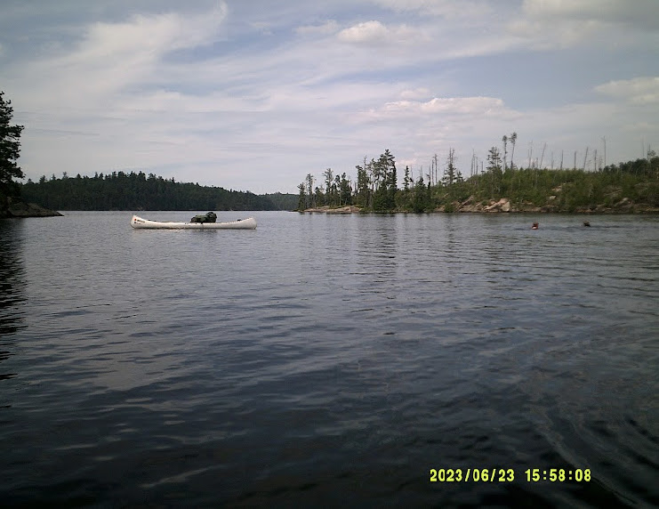
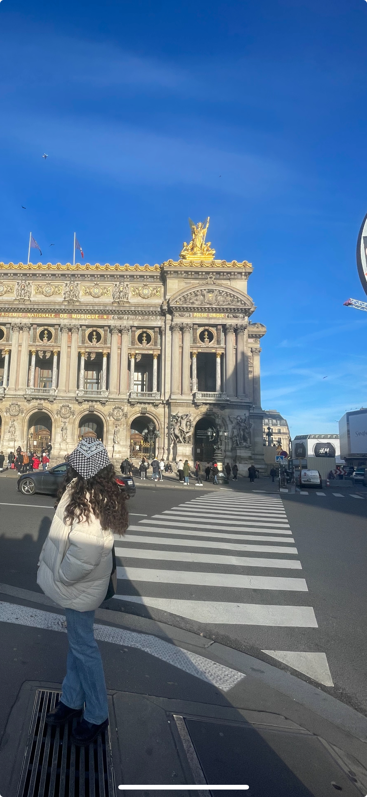

## Education and Professionally

  Currently, I am a Junior at Cornell University in Ithaca, New York. I'm
  studying Computer Science and Mathematics, and am currently planning on attending
  graduate school for a Masters of Engineering in Operations Research and Information
  Engineering, with a focus on Financial Engineering. 

## Personal

  I'm from New Albany, Ohio. In my free time, I try to be outside as much as
  possible, whether it's hiking the Grand Canyon with my family or leading 
  backcountry canoeing trips in the Quetico Wilderness Area of Canada. I also
  love to travel, and am consistently conscripted into being my sister's amateur 
  photographer. 